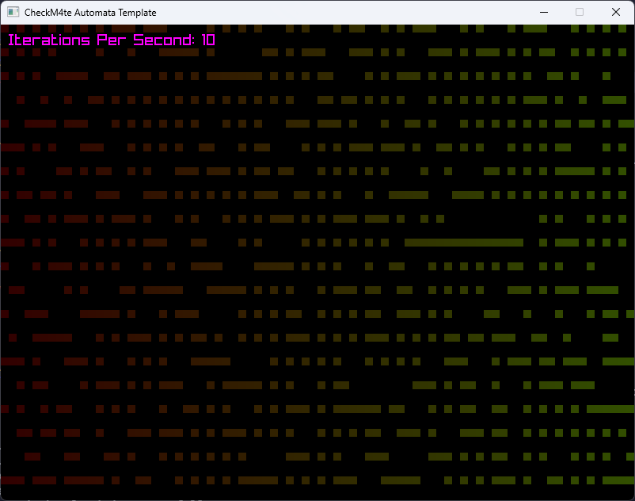

# automata
This a small template to start a cellular automata using Raylib with Go.
It includes functions such as `GetNeighbor` and `GetCell`, a `Vec2` struct for positions, and a `Game` struct where you can access the grid of cells easily

## controls
Space - Pause simulation
Mouse wheel - Simulation Speed
Ctrl + Mouse wheel - Zoom

## grid
The grid is a 2D array of pointers to the `Cell` struct.  
The cell struct has 2 values: `Color`: the color of the cell, `Alive`: wether the cell is or not alive, and `Position` a Vec2 that stores the cell position.

## game
The `Game` struct has:
- Width: The window width
- Height: The window height
- CellSize: The size of each cell: if Width and Height is 800 and CellSize is 10, there will be 80 cells.
- InitCellSize: The initial size, to know the size for NextGrid
- Grid: The grid of cells.
- NextGrid: Temporary grid to store the next state before it appears.
It also has the `GetNeighbor`, `GetNumberAliveNeighbors`, `GetCell` functions to easily make your rules for the automata.

## consts
The `main.go` file has these consts:
```go
const Width = 800
const Height = 800
const CellSize = 10

// Iterations Per Second (variable to be controlled by user)
var Speed_IPSecond = 10
```
These are used to set the other values easily.

## how to use:
Click "Use this template"
Clone the new repository.
Edit the init cells in `main.go`. By default even cells are alive.
Edit `update.go` this is the stuff that will happen to the cells each iteration

## screenshots


